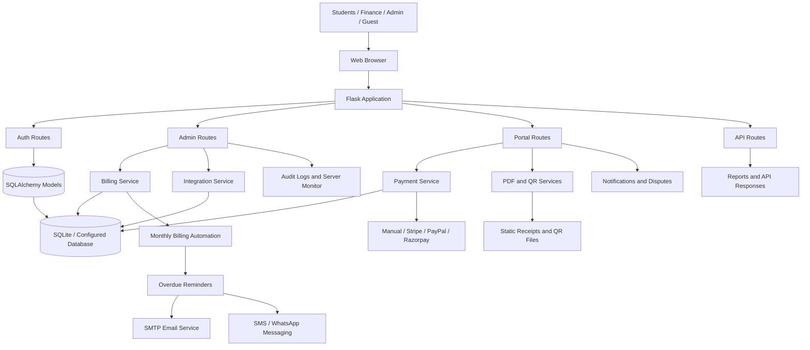

# Smart Billing System

Flask-based hostel billing system with role-based dashboards, monthly cost
allocation, payment tracking, email reminders, PDF receipts, QR codes, and
basic billing prediction.

## Generation 2 Update

This repository has been updated to Generation 2. The second generation focuses
on safer billing operations, clearer finance workflows, more payment options,
and a more complete administration experience for school hostel billing.

### Update contents

- Added role-based dashboards for administrators, finance staff, residents, and
  read-only guest accounts.
- Improved monthly billing with itemized charges, currency support, resident
  check-in based cost sharing, balances, and installment payments.
- Added payment-proof uploads, receipt ownership protection, unique monthly
  receipts, QR codes, and downloadable PDF receipts.
- Added notifications, audit logs, dispute handling, CSV/Excel reports, and
  session-authenticated API endpoints.
- Added automatic monthly bill generation and overdue reminder commands.
- Added an encrypted integration center for SMTP, Stripe, PayPal, Razorpay,
  Twilio SMS, and WhatsApp Cloud API settings.
- Improved security with CSRF protection, password hashing migration, protected
  sessions, and safer handling of payment/email failures.
- Improved deployment support with Docker, `.env.example`, Windows helper
  scripts, and a responsive light/dark interface.

## Project Diagram



## Generation 2 behavior details

- Itemized monthly bills support custom charges and currencies.
- Resident shares are calculated only from check-ins in the selected month.
- Payments support installments, balances, and uploaded transfer proof.
- Receipts are unique per resident/month and protected by ownership checks.
- SMTP failures do not undo successful payments; receipts remain downloadable.
- Roles include administrator, finance, resident, and read-only guest.
- Notifications, audit logs, disputes, CSV/Excel reports, and API endpoints
  are included.
- Monthly schedules can automatically generate itemized bills.
- Administrators can manage SMTP, Stripe, PayPal, Razorpay, Twilio SMS, and
  WhatsApp Cloud API credentials from one encrypted integration center.
- Light and dark themes use a mobile-responsive interface.
- All state-changing requests are protected with CSRF tokens.

## Local setup

On Windows, double-click `setup.bat` for dependency installation and tests,
then double-click `start.bat` to run the application. `test.bat` reruns the
test suite.

```powershell
python -m venv .venv
.\.venv\Scripts\Activate.ps1
pip install -r requirements.txt
Copy-Item .env.example .env
flask --app app run
```

Set the values from `.env` in your shell or use an environment loader before
starting Flask. Never commit the real mail password or `SECRET_KEY`. Keep
`SECRET_KEY` unchanged after saving integration credentials because it is used
to encrypt and decrypt them.

Existing plaintext passwords are automatically replaced with secure hashes
after each user's first successful login.

For HTTPS deployments, set `SESSION_COOKIE_SECURE=true` and set `APP_BASE_URL`
to the public application URL.

## Tests

```powershell
python -m unittest discover -s tests -v
```

## Automatic billing

Enable `AUTO_GENERATE_BILLS=true`, then configure the schedule on the Billing
page. The application checks once per day. It can also be run explicitly:

```powershell
flask --app app generate-monthly-bills
flask --app app send-overdue-reminders
```

## Reports and API

Finance and administrator accounts can use `/reports` and export CSV or Excel.
Session-authenticated API endpoints are available at:

- `GET /api/v1/bills`
- `GET /api/v1/billing-periods`

## Payments

Manual installments and payment-proof review work without external accounts.
`PAYMENT_PROVIDER=manual` is the default. Administrators can open
`/integrations` to save and test Stripe, PayPal, Razorpay, SMTP, Twilio SMS, and
WhatsApp credentials. SMTP, Twilio, WhatsApp, and Stripe API adapters are
connected to the application. PayPal and Razorpay credentials can be verified,
while their hosted checkout flows still require provider-specific completion.

Saved secrets are encrypted in the database and only masked values are rendered
in the browser. SMTP values from `.env` appear as defaults until the first
managed SMTP configuration is saved.


## Docker

```powershell
Copy-Item .env.example .env
docker compose up --build
```

Open `http://127.0.0.1:5000`. Before production, set a strong `SECRET_KEY`,
enable HTTPS, and set `SESSION_COOKIE_SECURE=true`.

## Admin 


## USer


